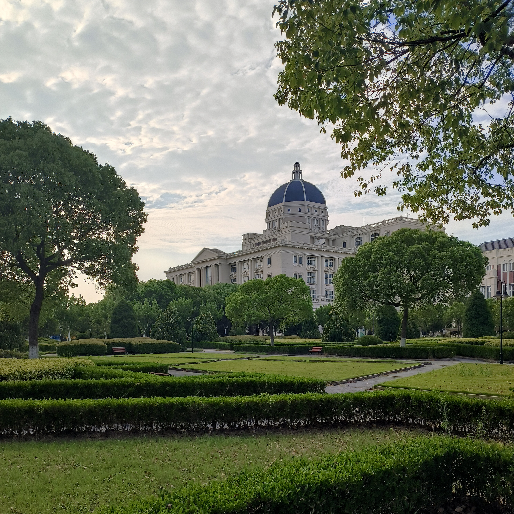

.. Potential support for work

Overview for CMRIR of SISU
=================================

After graduating with my master's degree in 2022, I was fortunate enough to join 
`Centre for Megnetic Resonance Imaging Research <https://bmib.shisu.edu.cn/>`__ 
of `Shanghai International Studies University <https://shisu.edu.cn/>`__ as a 
Technical Engineer.

