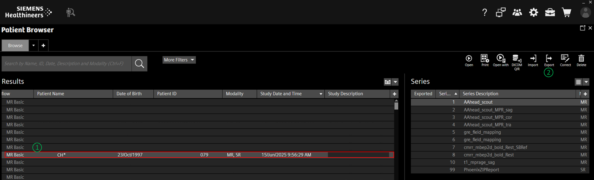
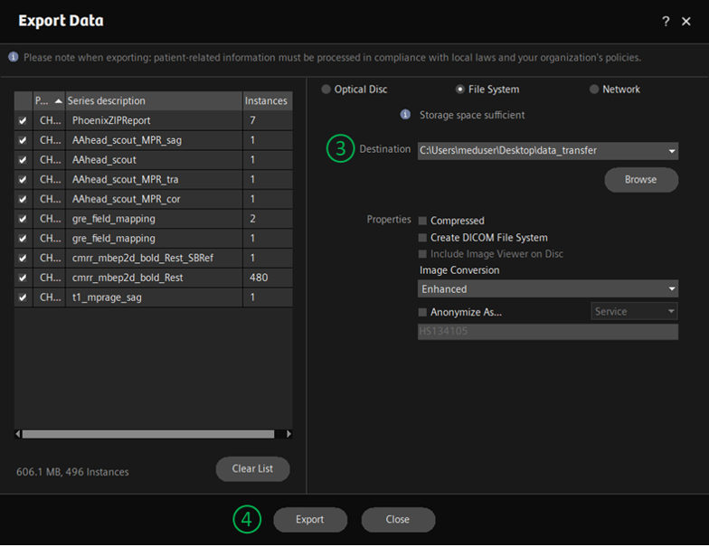
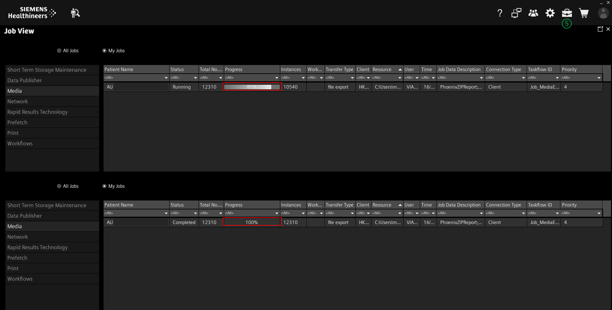
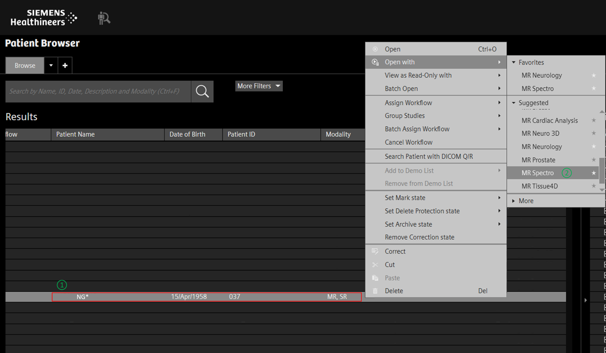
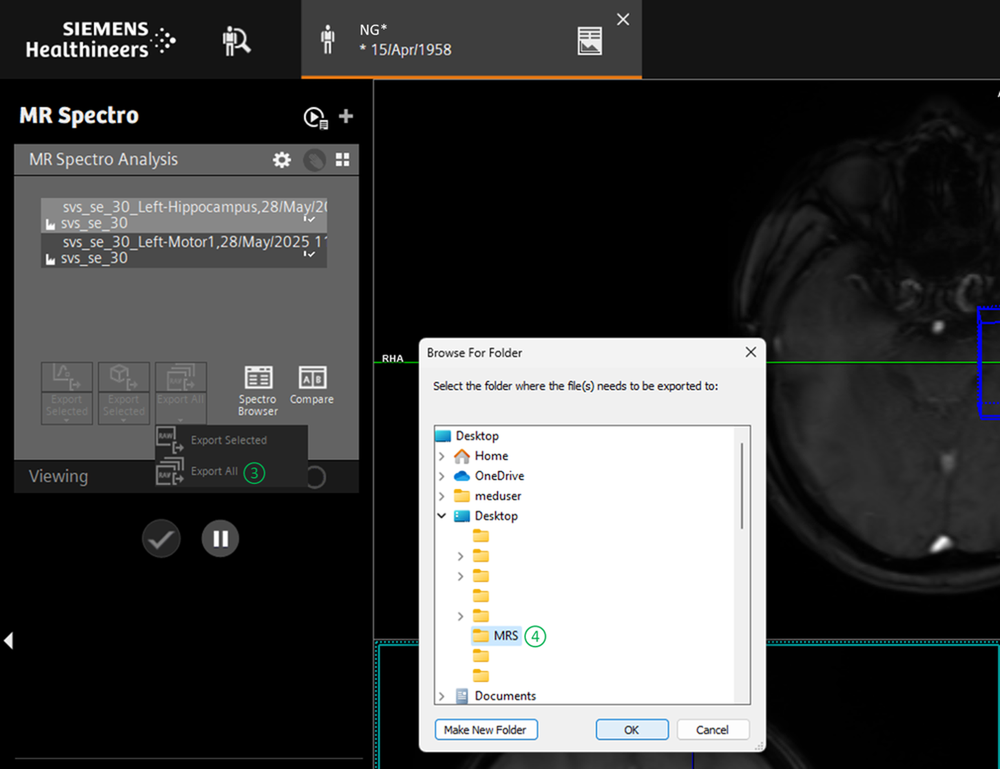
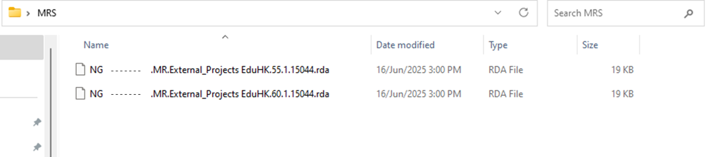
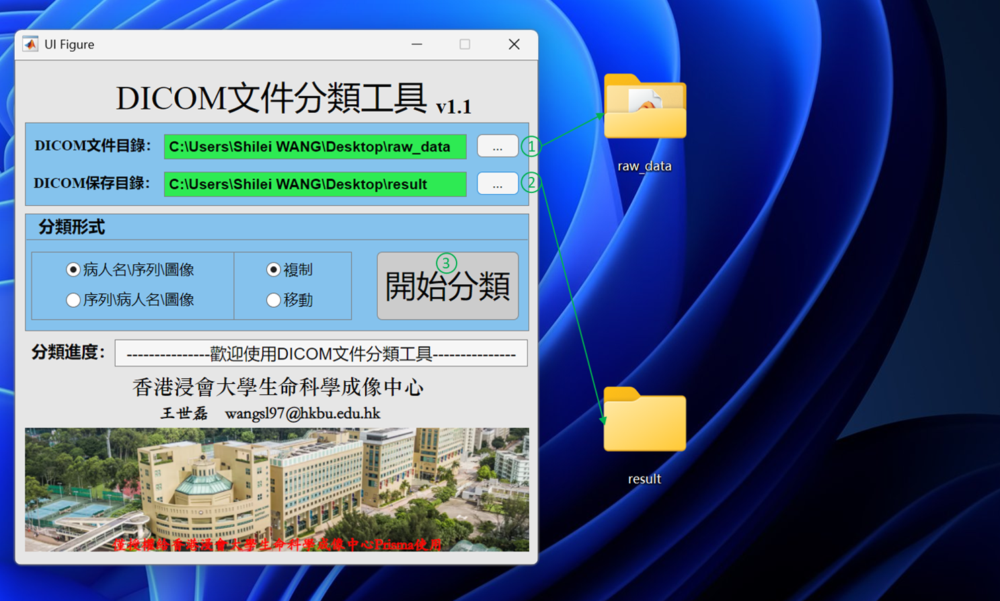
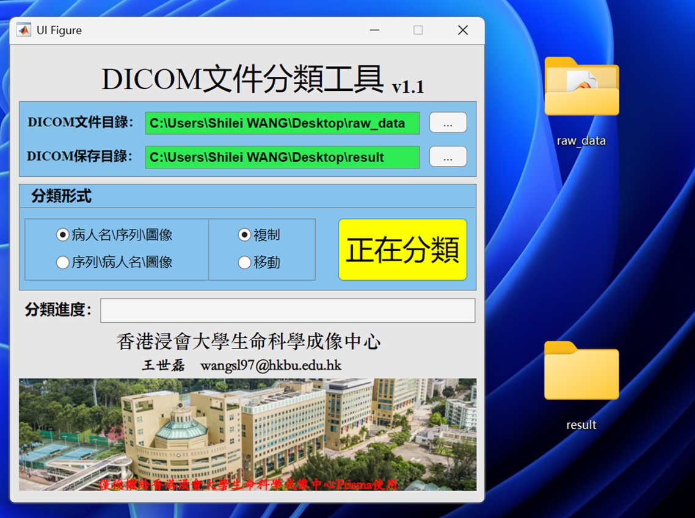
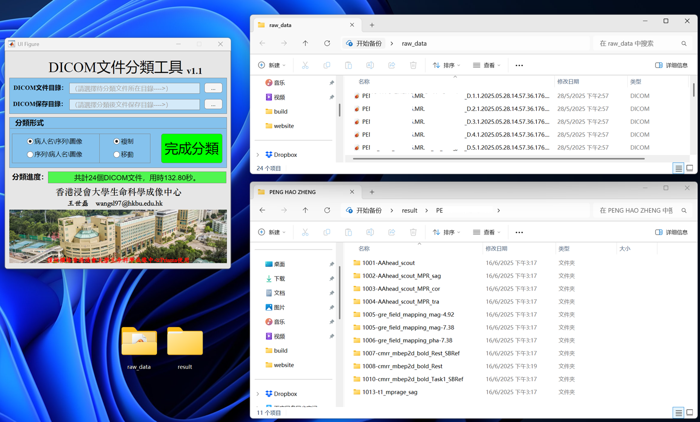

.. How to download, sort and copy MR data

Download, sorting and copying MR data
=====================================

.. note::

  The experimenters need to download and copy the experimental data of the corresponding project 
  in MR control room according to the following methods after the data collection is completed 
  on the same day.
  
  Please check the integrity and quality of the data by yourself as soon as possible. If you 
  have any problems, please contact `LSIC <mailto:lsic_enquiry@hkbu.edu.hk>`__. 
  
  LSIC will only retain your data for **7 days** !!!!

----------------------
1. Download data (`*.dicom file`) from Syngo.via
----------------------

1.1  After data collection, data can be sent to Siemens Syngo.via directly from the scanner.
Please launch ``Syngo.via`` (shortcut on the Desktop) on the computer in the MR Control 
room, select your dataset in the **Patient Browser**, then click ``Export``.

1.2  Make sure all the series you want to send are checked, then select ``Destination`` in File System,
such as your folder built on the Desktop and click ``Export``.

.. note::

  Please keep all the options in Properties **consistent with the following figure**.

1.3  Click "💼" in the upper right corner to check the progress of data download. 
When the progress bar shows `100%`, it means that all data has been successfully downloaded 
to the directory you specified.

-----------------------
2. Download data from (`*.rda of MRS`) Syngo.via
-----------------------

2.1  To export the rda files of MR Spectroscopy, go into the **Patient Browser** and select your participant.
Right click on them and select the ``MR Spectro`` option.

2.2  Go under the MR Spectro Analysis gray box on the lefthand side of the screen and click ``Export Select Raw`` 
and click ``Export All``. Select your drive (typically: Desktop) and both files will be saved there.

2.3   The system makes the rda files itself and you can no longer name the files.

----------------------------
3. Sorting data by the customized toolkit "DICOM_sorter"
----------------------------

After directly downloading data from Syngo.via, researchers often cannot easily distinguish which sequences 
these data correspond to. To solve this problem, LSIC provides a customized toolkit **"DICOM_sorter"** for 
data sorting.

3.1  Double-click the icon named ``DICOM_sorter`` on the computer desktop. Select the ``original directory`` 
of dicom files (the directory where the raw data is located) and the ``targeted directory`` (the directory 
where the sorted data is located) respectively. Click ``Start sorting``.

.. warning::
  This toolkit is not applicable to the above-mentioned ``*.rda`` files.

3.2  When the sorting is in progress, a yellow block of ``Sorting in Progress`` is presented. 
The time spent on sorting varies according to the number of dicom files.

3.3  When the sorting is completed, a green block of ``Sorting Completed`` is presented. Compared 
with the original folders, the sorted folders store the corresponding dicom files according to the sequences' names.

----------------------------
4. Sorting data by the customized Python script
----------------------------

Considering that data sorting of the above toolkit is rather time-consuming, LSIC provides the following 
customized Python script. Researchers can download the script and, on the premise of ensuring that the 
package ``pydicom`` is installed in the python environment, run the following code block to quickly implement 
data sorting.

.. |script| replace:: :download:`Python script <./LSIC-dicomsort-Shilei.py>`

Download the customized |script|.

Usage:

.. code-block:: python

    python3.6 LSIC-dicomsort-Shilei.py /raw_dicom_path/ /aim_path/%PatientID/%PatientName/%SeriesDescription/%PatientName-%SeriesDescription-%InstanceNumber.dcm

